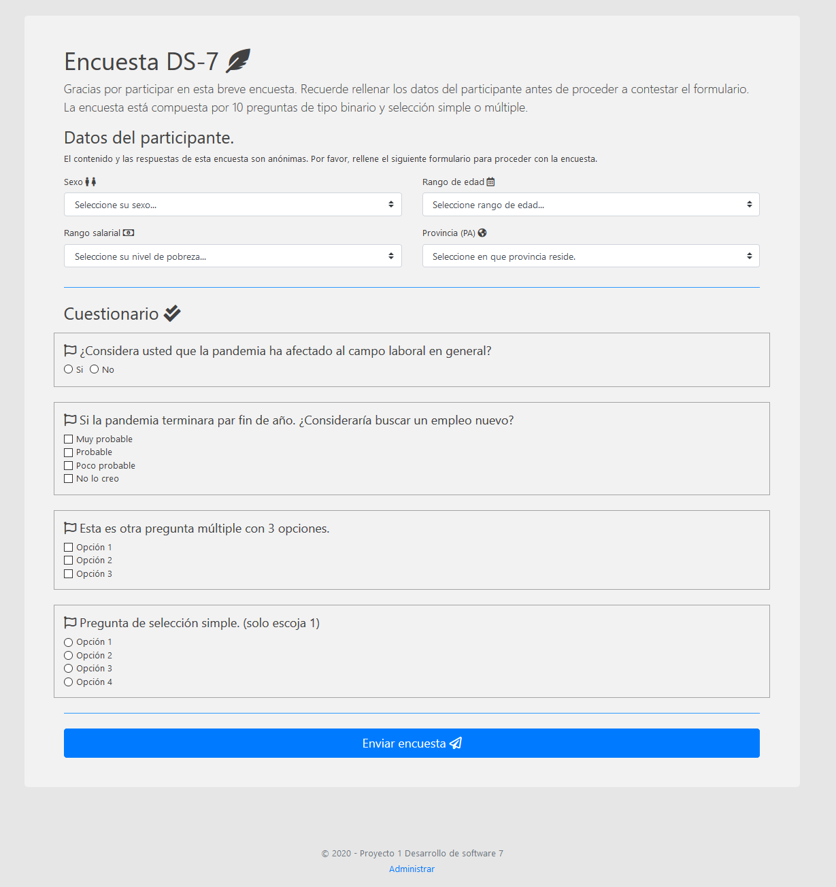
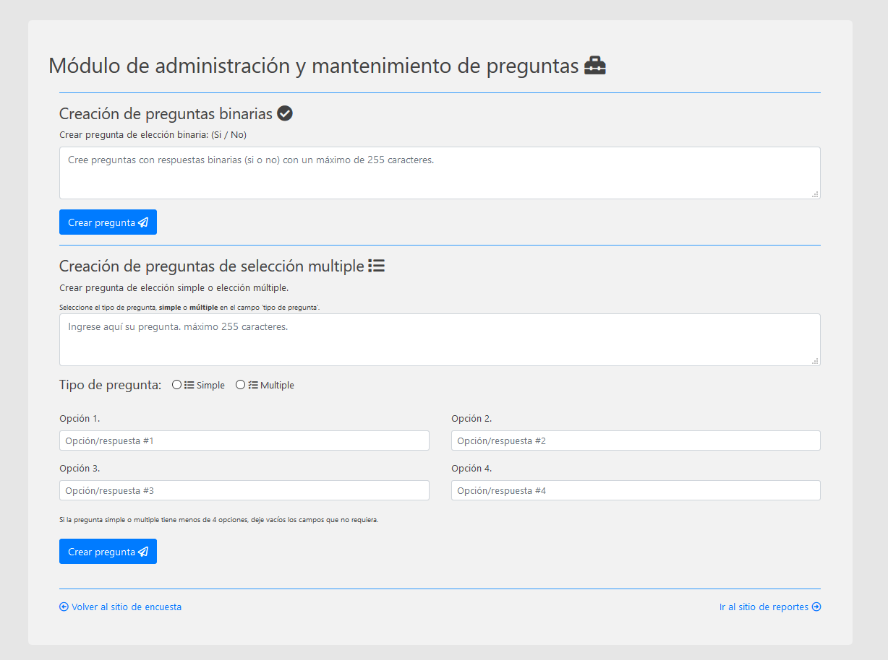
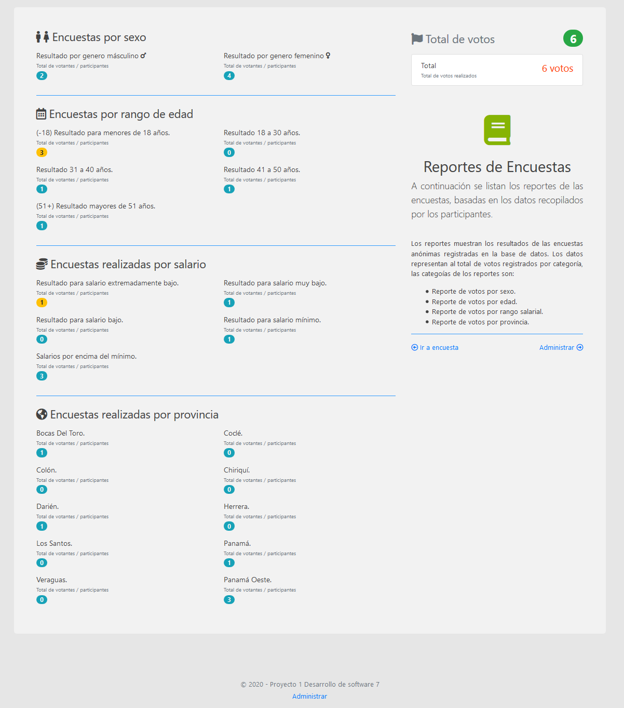

# Encuestas-DS7
Proyecto 1, desarrollo de software 7

### Features
- Encuestas dinámicas personalizadas.
- Dashboard flexible para administración;
- Dashboard de reportes para administrar datos de las encuestas insertadas en la base de datos;
  - Conteo de votos totales.
  - Conteo de votos por género.
  - Conteo de votos por edad.
  - Conteo de votos por salario.
  - Conteo de votos por provincia (PA).
- **Filtro de preguntas y randomización pendientes**

Capturas de pantalla:
-------------
### Dashboard principal.

### Dashboard administración.

### Dashboard reportes.

